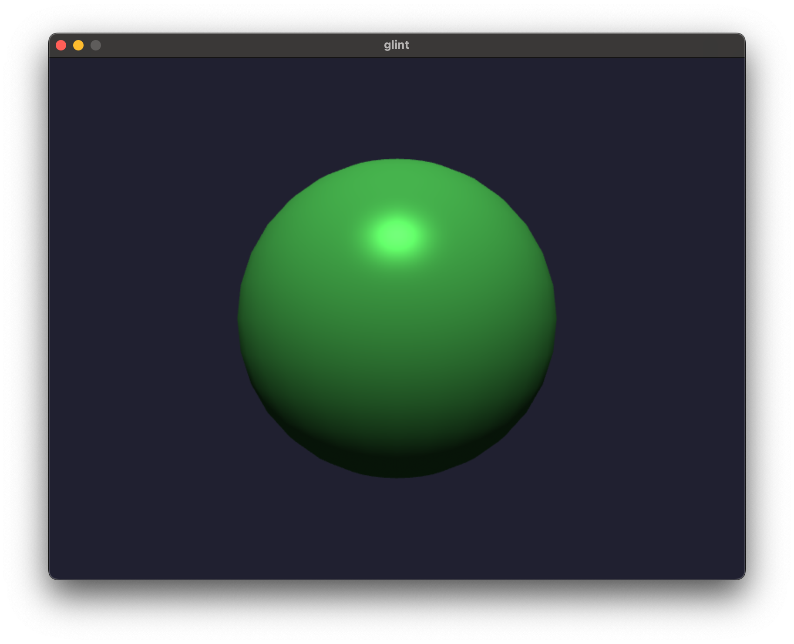
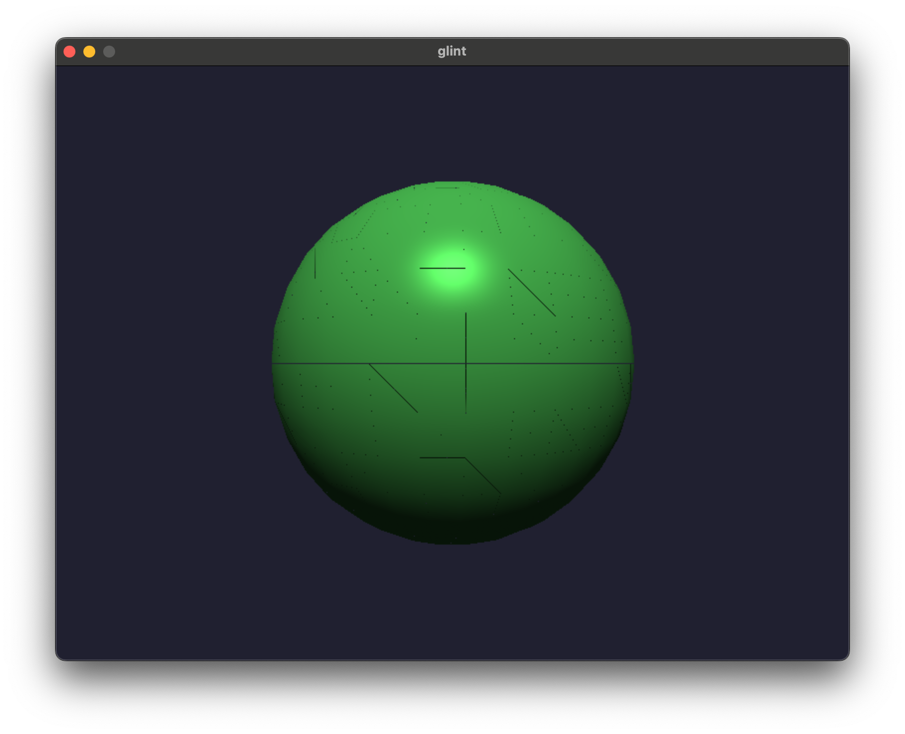
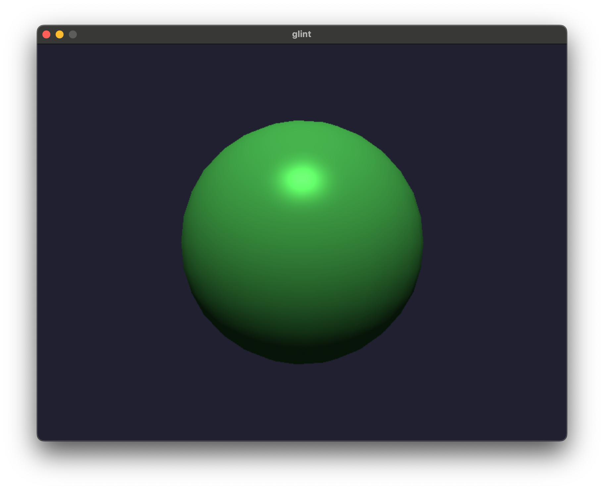

# glint

A from-scratch real-time renderer in C++ — and the execution target for a JIT-compiled shading language built on LLVM.

The renderer runs today: a software rasterizer drawing perspective-correct, Phong-lit geometry in real time, with anti-aliasing. The longer arc is a compiler project — a small shading language compiled to native code through LLVM's ORC JIT, using shader throughput on this renderer as the way to measure optimization impact. Graphics is the substrate; the eventual subject is compiler optimization.



## What it does today

A complete software rendering pipeline in C++17 with **no graphics API** — every stage, from vertex transform to pixel resolve, is hand-implemented:

- **Rasterization** via edge functions and barycentric coordinates, with a z-buffer for depth testing
- **Full 3D pipeline** — `Vec3`/`Vec4`, `Mat4`, model-view-projection transforms, perspective projection
- **Perspective-correct interpolation** of per-vertex normals and colors
- **Phong lighting** — the seam where the JIT-compiled shader will later plug in
- **4x MSAA** with per-sample depth testing and box-filter resolve
- Real-time, mouse-driven rotation via SDL2

## Technical highlights

A few of the problems that were more than mechanical:

### Perspective-correct interpolation — and knowing when you *don't* need it

Barycentric weights computed in screen space are distorted by the perspective divide, so interpolating world-space quantities (normals, colors) with them directly produces visible drift. The fix is to interpolate each attribute as `a · (1/w)` with the screen-space weights, then divide by the interpolated `1/w`.

The non-obvious part is the exception: depth (NDC `z`, taken *after* the perspective divide) must **not** be corrected — it is already linear in screen space, so "correcting" it would introduce error rather than remove it. The general rule the pipeline follows: quantities computed *before* the perspective divide need correction; quantities computed *after* it do not.

### Robust rasterization at the edges

Two correctness bugs that only surface at boundaries:

**Cracks between adjacent triangles.** A strict `> 0` edge test rejects a pixel lying exactly on a shared edge from *both* neighboring triangles, leaving thin background-colored seams. Switching to `>= 0` closes them — the z-buffer absorbs the duplicate writes. The principled fix, and the one GPUs use, is the top-left rule, which assigns each shared edge to exactly one triangle.

| Before — `> 0` leaves cracks | After — `>= 0` |
|---|---|
|  |  |

**Degenerate triangles becoming `NaN`.** At the poles of a UV sphere, quads collapse into zero-area or sliver triangles. Dividing edge values by a near-zero area blows float error up into `NaN`, producing garbage pixels around the poles. An area-threshold early-out guards against it; the cleaner long-term fix is to generate pole geometry as triangle fans, eliminating the degenerate quads entirely.

## Build

```sh
cmake -B build && cmake --build build
./build/glint
```

Tested on macOS (Apple Silicon). SDL2 is expected at `/opt/homebrew`.

**Controls:** click + drag to rotate.

## Dependencies

- C++17
- [SDL2](https://libsdl.org/) — window and framebuffer display
- LLVM 17 (Core, ORC JIT, IRBuilder) — for the shading-language backend; not required to build the renderer yet

## Roadmap

The renderer is Phase 1. The compiler is the destination.

| Phase | Description | Status |
|---|---|---|
| 1 | Software rasterizer (C++ only) | ✓ done |
| 2 | Shading language design | |
| 3 | Frontend — lexer, parser, AST | |
| 4A | Backend — LLVM IR + ORC JIT | |
| 4B | Metal backend (MSL) | |
| 5 | LLVM optimization experiments + benchmarking | |
| 6 | Ray tracer as a richer execution target | |